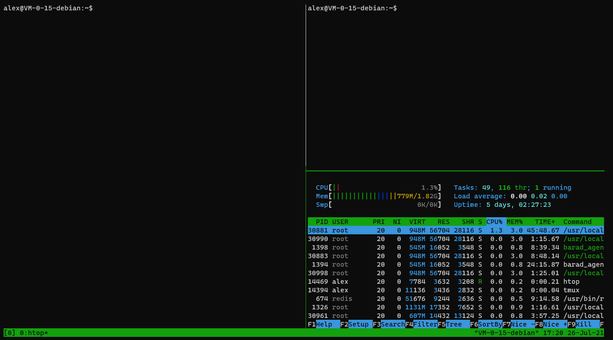

# tmux常用快捷键

+ 安装tmux

```bash
sudo apt install tmux
```

+ 常用快捷键

```bash
# 获取帮助 查看各快捷键
快捷键：Ctrl+b ?

# 查看有所有tmux会话
指  令：tmux ls
快捷键：Ctrl+b s

# 新建tmux窗口
指  令：tmux new -s <session-name>

# 重命名会话
指  令：tmux rename-session -t <old-name> <new-name>
快捷键：Ctrl+b $

# 分离会话
指  令：tmux detach  或者使用  exit(关闭窗口)
快捷键：Ctrl+b d

# 重新连接会话
指  令：tmux attach -t <session-name>  或者使用 tmux at -t <session-name>

#平铺当前窗格（个人很喜欢的快捷键，注意：平铺的是当前选中的窗格）
快捷键：Ctrl+b z (再次 Ctrl+b z 则恢复)

# 杀死会话
指  令：tmux kill-session -t <session-name>

# 切换会话
指  令：tmux switch -t <session-name>

# 横向分屏
指  令：tmux split
快捷键：Ctrl+b “

# 纵向分屏
指  令：tmux split -h
快捷键：Ctrl+b %

# 光标切换到上方窗格
指  令：tmux select-pane -U
快捷键：Ctrl+b 方向键上

# 光标切换到下方窗格
指  令：tmux select-pane -D
快捷键：Ctrl+b 方向键下

# 光标切换到左边窗格
指  令：tmux select-pane -L
快捷键：Ctrl+b 方向键左

# 光标切换到右边窗格
指  令：tmux select-pane -R
快捷键：Ctrl+b 方向键右
```

+ 实用案例

```bash
#安装htop
sudo apt install htop
#分屏
tmux
c-b %
c-b "
```

如图：

